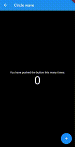
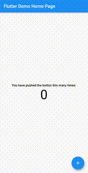
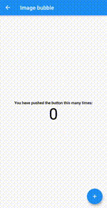
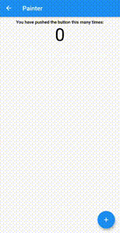
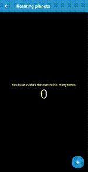
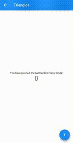
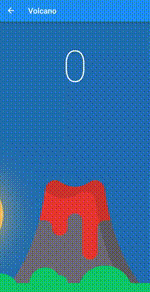

[![Sponsor me][sponsor_badge]][sponsor_me]

# flutter_counter_challenge_2020

A set of counter apps made for #FlutterCounterChallenge2020.

Run `flutter create .` inside the repository after cloning it, to initialize the app folders.

## Blocks

## Circle wave

Original idea from https://dribbble.com/shots/1698964-Circle-wave-II 

## Creatures

Original idea from https://gist.github.com/beesandbombs/6f3e6fb723f50b080916816ae8e561e3

## Disks

## Image bubble

## Mattis

## Particles

Original idea from https://www.openprocessing.org/sketch/427313

## Portrait

Original idea from https://www.openprocessing.org/sketch/392202/

## Rotating bubbles

## Rotating planets

Original idea from https://twitter.com/beesandbombs/status/1329468633723101187?s=20

## Triangles

## Volcano

## Wave

<!-- Links -->
[sponsor_badge]: https://img.shields.io/badge/Sponsor-♥-green.svg
[sponsor_me]: https://github.com/letsar#reach-me

